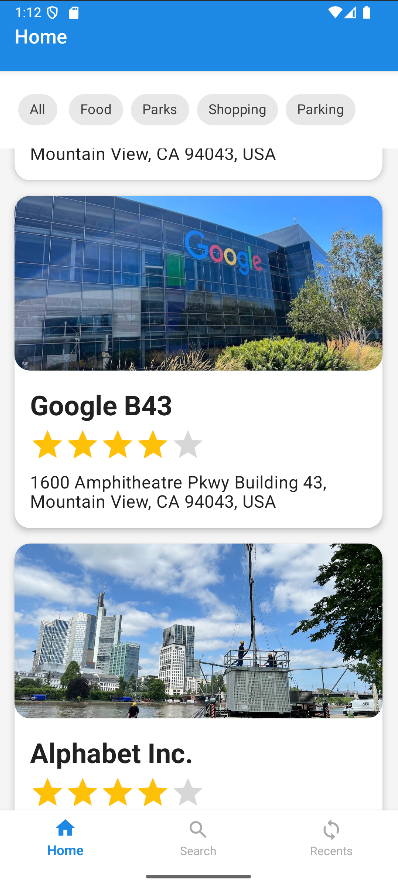
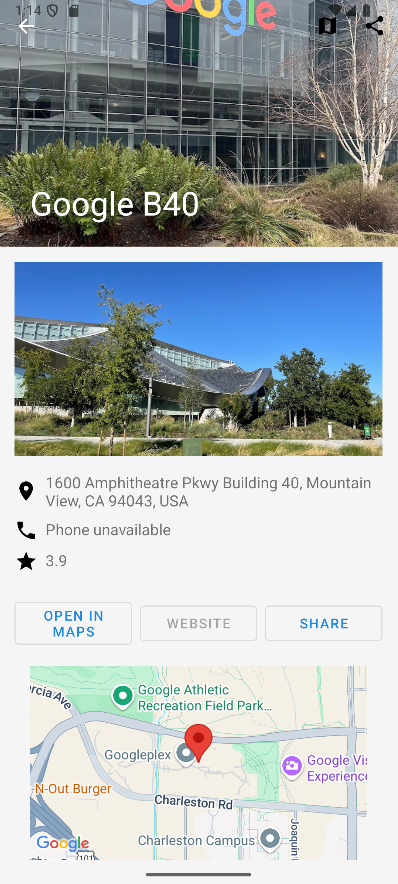
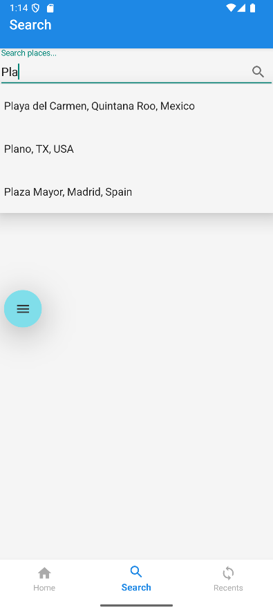
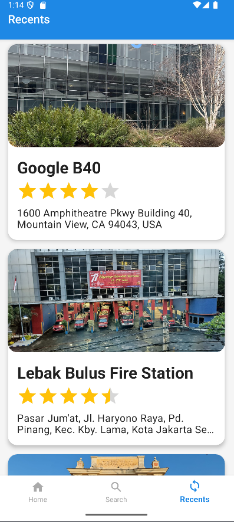

# CityExplorer

An Android application that helps you discover and explore places around you using the Google Places SDK and the Google Places HTTP API.

## Features

-   **Bottom Navigation**  
    – Home: Browse nearby places with chip-based category filters (“All”, Food, Parks, etc.)  
    – Search: Autocomplete search powered by the Google Places SDK  
    – Recents: View your recently opened places (saved via SharedPreferences)

-   **Place Detail**  
    – Full place information (name, address, rating, opening hours)  
    – Map view of the place location  
    – Photo carousel (SDK & HTTP photo API)  
    – Share button to send place info via your favorite apps, with a custom Share string

-   **Dual Data Sources**  
    – Uses the Google Places SDK for “All”  
    – Falls back to the HTTP Nearby Search API via Volley for category-specific results  
    – Glide for efficient image loading

## Screenshots









## Tech Stack

-   **Language:** Java
-   **Architecture:** MVVM (Activities + ViewModels + Repository)
-   **Dependencies:**
    -   Google Places SDK for Android
    -   Volley for HTTP requests
    -   Glide for image loading
    -   AndroidX (AppCompat, Lifecycle, RecyclerView, Navigation)

## Requirements

-   Android Studio 4.2 or higher
-   Android SDK Platform 33
-   A valid Google Maps & Places API key

## How to Use

-   Add your API key in your `local.properties` (project root) as:
    ```properties
    MAPS_API_KEY=api_key_here
    ```
